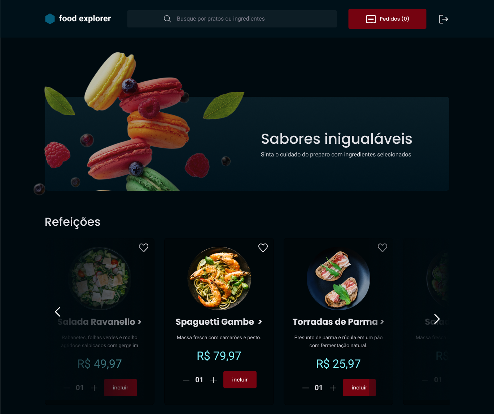

<h1>FoodExplorer</h1>

<br>

<p align="center">
  
</p>

<br>

<h2> Sumário </h2>

1. [O projeto](#o-projeto)
2. [Tecnologias, Bibliotecas e Ferramentas](#tecnologias-bibliotecas-e-ferramentas)
3. [Funcionalidades](#funcionalidades)
4. [Utilizando a API](#utilizando-a-api)

<br>

## O Projeto
O projeto foi desenvolvido como desafio final do programa [Explorer da Rocketseat](https://www.rocketseat.com.br/explorer). Ele segue a ideia de uma aplicação com cardápio interativo e digital para um restaurante fictício. 

**OBS**: O layout da aplicação está disponível e pode ser acessado através do [Figma](https://www.figma.com/file/GkqG5AUJe3ppcUEHfvOX6z/food-explorer?type=design&node-id=0-1&mode=design&t=wB70PWRN3XpNKK4t-0).
<br>

Na aplicação temos duas personas:

**usuário comum (cadastrado)**: irá visualizar todos os pratos cadastrados e, quando clicar em um prato, será redirecionado para uma nova tela com informações mais detalhadas sobre ele.

**usuário admin**: é a pessoa responsável pelo restaurante, logo, poderá criar, visualizar, editar e apagar um prato a qualquer momento. Cada prato contem uma imagem, um nome, uma categoria, uma breve descrição, os ingredientes e o seu preço. Ao clicar em adicionar prato, o admin receberá uma mensagem de sucesso e será redirecionado para a página principal;

Quer conferir o FoodExplorer? [Visite o projeto online.]()

**OBS: Está sendo desenvolvido o frontend da aplicação.**
<br>

### Fluxograma da aplicação
Visto que temos duas personas, o fluxograma da aplicação ou as rotas de acesso de cada usuário é dividido da seguinte maneira:

<br>

<p align="center">
  
</p>

<br>

<!--
<br>
### Diagrama do banco de dados

Utilizando a ferramenta online drawSQL criou-se o diagrama da estrutura do banco de dados da aplicação. Ele vai funcionar da seguinte forma:

<br>

<p align="center">
  
</p>

<br>
-->

## Tecnologias, Bibliotecas e Ferramentas

Estão sendo utilizadas as seguintes tecnologias, bibliotecas e ferramentas para o desenvolvimento do backend desse projeto:

- **JavaScript** - Faz toda a lógica da aplicação;
- **NodeJS** - Executa o JavaScript fora do navegador;
  - **Express** - Framework responsável por lidar com as requisições HTTP;
  - **Middleware** - Intercepta as solicitações-respostas da aplicação;
  - **SQlite** - Faz o armazenamento dos dados;
  - **bcryptjs** - Criptografa as senhas de usuário;
  - **Knex** - Gera os comandos SQL;
  - **JWT (JSONwebtoken)** - Faz a troca de informações no fluxo de autenticação entre aplicação e a API;
  - **multer** - Gerencia o upload de imagens;
  - **API Restful** - API que pode ser consumida cumprindo e aplicando as diretrizes RESTful;
  - **Cors** - Faz a conexão entre o backend e o frontend da aplicação;
  - **dotenv** - Cria variáveis de ambiente para lidar com dados sensíveis da aplicação;
  - **PM2** - Mantém a API sempre em execução;
  - **Deploy com render** - Utilizando o render para fazer a hospedagem do backend;
  - **Jest** - Realiza testes automatizados de integração;
- **Insomnia** - Lida com os testes da API fora do navegador;
- **Beekeper Studio** - Auxilia na visualização e execução de funções em nosso banco da dados;
- **Git** - Responsável por realizar o gerenciamento de versionamento do código;
- **GitHub** - Utilizado para armazenar a aplicação em nuvem.

<br>

## Funcionalidades

A aplicação vai nos permitir:

- [x] Cadastrar usuário;
- [x] autenticar usuário para fazer login;
- [x] Atualizar e-mail, senha ou nome de um usuário;
- [x] Mostrar informações de um prato especifico;
- [x] Cadastrar, atualizar, mostrar ou deletar um prato.

<br>

## Utilizando a API

- [Pré-requisitos de inicialização](#pré-requisitos-de-inicialização)
- [Iniciando o servidor](#iniciando-o-servidor)
- [Trabalhando as requisições](#trabalhando-as-requisições)
  - [Seções](#seções)

<br>

A aplicação FoodExplorer é dividida em duas partes:
1. Servidor/ Backend (API)
2. Frontend

**IMPORTANTE**: O backend precisa estar rodando na mesma maquina que o frontend para que ele seja renderizado de maneira correta.

### Pré-requisitos de inicialização

Antes de começar a utilização da API é necessário ter instalado em sua máquina as seguintes ferramentas de trabalho:
- [VSCode](https://code.visualstudio.com/download) (ou algum editor de código)
- [Git](https://git-scm.com/download/) (de acordo com o seu sistema operacional)
- [Node.js](https://nodejs.org/pt-br/download/current) (de acordo com o seu sistema operacional)

### Iniciando o servidor

**DICA**: Comece criando uma pasta na sua area de trabalho ou local a desejar, pois facilitará na busca pelos arquivos/ pasta clonada.

- Acesse a sua pasta dentro do terminal/ cmd
```bash
# Comando
$ cd + caminhoDaSuaPasta (arraste a pasta que o caminho será colocado automaticamente)
```

- Clone o projeto para dentro da sua pasta
```bash
# Comando
$ git clone https://github.com/EltonPrado/Projeto23_FoodExplorer_Backend.git
```

- Entre no diretório
```bash
# Comando
$ cd Projeto23_FoodExplorer_Backend
```

- Instale as dependências
```bash
# Comando
$ npm install
```

- Execute as migrations e o seed
```bash
# Comando
$ npm run migrate
$ npm run seed
```
**OBS**: Para simplificar os comandos `npx knex migrate:latest` e `npx knex seed:run` para `npm run migrate` e `npm run seed` foi criado scripts dentro do arquivo package.json.

- Inicie o servidor local da aplicação
```bash
# Comando
$ npm run dev
```

Se tudo ocorrer bem, a seguinte mensagem vai aparecer no terminal:

```bash
Server is running on port 3333.
```

Isso significa que o servidor estará sendo inicializado na porta:3333. Utilize a URL base: `https://localhost:3333` dentro do Insomnia para fazer as requisições e acessar os recursos da API.
<!--
### Trabalhando as requisições

#### Seções

- **Criando uma seção**
-->
