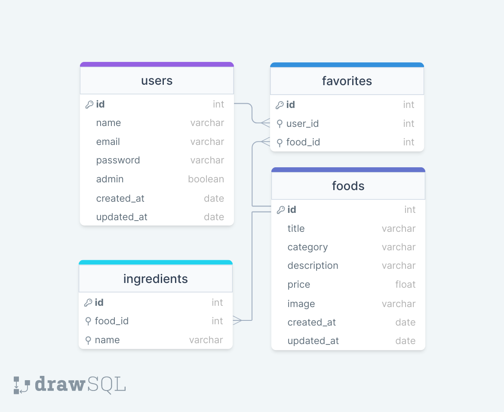

<h1>FoodExplorer</h1>

 

<h2> Sumário </h2>

1. [O projeto](#o-projeto)
2. [Fluxograma da aplicação](#fluxograma-da-aplicação)
3. [Diagrama do banco de dados](#diagrama-do-banco-de-dados)
4. [Ferramentas e Tecnologias](#ferramentas-e-tecnologias)
<!--
5. [Funcionalidades](#funcionalidades)
-->

 

## O Projeto

O projeto foi desenvolvido como desafio final do programa [Explorer da Rocketseat](https://www.rocketseat.com.br/explorer). Ele segue a ideia de uma aplicação com cardápio interativo e digital para um restaurante fictício. Na aplicação temos duas personas: o usuário e o admin;

**usuário comum (cadastrado)**: irá visualizar todos os pratos cadastrados e, quando clicar em um prato, será redirecionado para uma nova tela com informações mais detalhadas sobre ele.

**usuário admin**: é a pessoa responsável pelo restaurante, logo, poderá criar, visualizar, editar e apagar um prato a qualquer momento. Cada prato deve conter uma imagem, um nome, uma categoria, uma breve descrição, os ingredientes e o seu preço. Ao clicar em adicionar prato, o admin receberá uma mensagem de sucesso e será redirecionado para a página principal;

 

Quer conferir o FoodExplorer? [Visite o projeto online.]()

**OBS: A aplicação está em desenvolvimento.**

 

## Fluxograma da aplicação

O fluxograma da aplicação ou as rotas de acesso de cada usuário é dividido da seguinte maneira:

 

  

 

## Diagrama do banco de dados

Utilizando a ferramenta online drawSQL criou-se o diagrama da estrutura do banco de dados da aplicação. Ele vai funcionar da seguinte forma:

 

  

 

## Ferramentas e Tecnologias

Será utilizado as seguintes tecnologias para desenvolver o backend desse projeto:

- HTML
- JavaScript
- NodeJS
  - bcryptjs
  - Cors
  - Express
  - JSONwebtoken
  - Knex
  - multer
  - SQlite
  - JWT;
  - Middlewares
  - API Restful
  - PM2
  - Deploy e utilização do render
  - Variáveis de ambiente
  - Testes automatizados
  - Jest
- Beekeeper
- Insomnia
- Git
- GitHub

 

<!--
## Funcionalidades

A aplicação vai nos permitir:
- Cadastrar usuário;
- autenticar usuário para fazer login;
- Atualizar e-mail, senha ou nome de um usuário;
- Mostrar informações de um prato especifico;
- Cadastrar, atualizar, mostrar ou deletar um prato.
- Cadastrar, ou mostrar um ingrediente.
-->